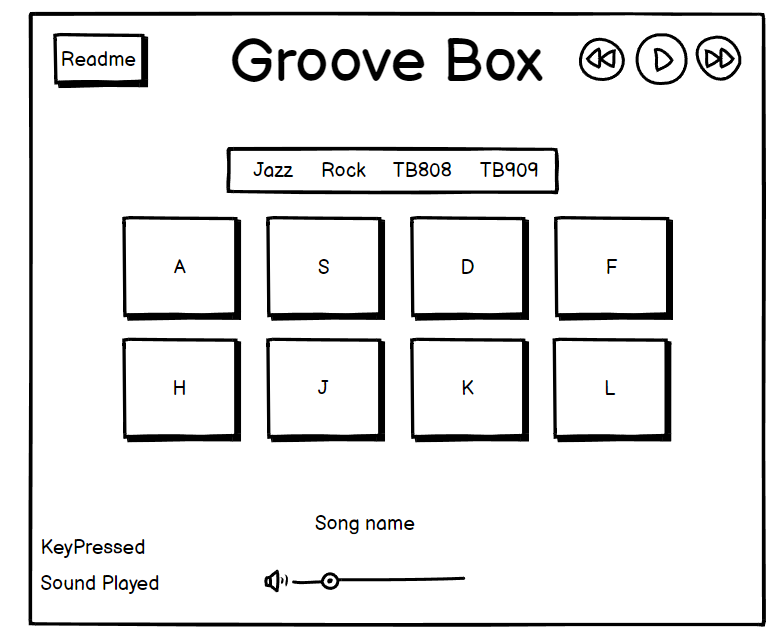

# Groove Box

Are you tired of those mundane, monotonous commutes that drain your energy and leave you craving some excitement? Say goodbye to boredom and hello to the next level of musical exhilaration with my revolutionary Groove Box! Designed with JavaScript, reachable with any browser on any device, its specifically for those seeking an escape from the daily grind, my sleek and minimalistic creation is here to spread joy!

Featuring a powerful drum machine, a sequencer, a versatile loop player, and a captivating backing track player, my groove box is a true all-in-one powerhouse. Let your creativity flow as you layer captivating beats, craft mesmerizing melodies, and unleash your inner musical genius!

[Visit the Live Page Here!](https://birgerosterberg.github.io/groovebox/)

## Design

My design philosophy for this Groove Box was centered around minimalism and elegance, focusing primarily on the core functions. I believe that excessive visual embellishments can detract from the essence of the tool. Following in the footsteps of many Digital Audio Workstations (DAWs), I aimed to create a streamlined interface that places music-making at the forefront, allowing users to immerse themselves in the creative process without unnecessary distractions.

Color code HIGH END AND CLASSY used from: \
https://hookagency.com/blog/web-design-color-palettes/ \
 \
dark-gold {color: #8E793E} \
light-gold {color: #AD974F}\
intellectual-grey {color: #231F20} \
light-grey {color: #EAEAEA}

Gradients from: \
https://cssgradient.io/ \

Box Shadows from: \
https://getcssscan.com/css-box-shadow-examples

## Wireframe

This marks the beginning of my project, which has undergone significant evolution since its initial wireframe stage. Unfortunately, my trial period for Balsamiq expired, preventing me from creating an updated wireframe reflecting the final result. Nonetheless, this initial wireframe provides a glimpse into my original vision. Now, you can experience the complete product and witness how it has expanded beyond its initial concept. It serves as a testament to its origins while showcasing the complexities it has since embraced.

---

## Features

---

### **Header / Logo**

I have implemented a basic h1 header as the logo, featuring a sleek and elegant design. The header incorporates a background image of a soundwave, adding a touch of visual appeal to the overall aesthetic.

---

### **Menu**

I've added a menu at the top of the groove box with a "How To" section for instructions and a pause button to stop all active audio. It also includes a volume control with a text display showing the percentage and + / - buttons for 10% adjustments. This menu enhances usability and offers quick access to important features for an improved user experience.

The How To is also where i decided to put what usually is footer content with info about me and contact details, to keep the Groove Box just as that, a Groove Box, giving it a more "App" feeling and something elegant.

---

### **Navigation**

I have opted for a tab-based navigation system, enabling seamless switching between different sections with ease. This design choice allows me to keep various parts of the Groove Box sounds active while effortlessly transitioning to the desired section.

Moreover, this design solution offers the convenience of utilizing keyboard keys on desktop devices to play the Drum Machine within each of the Groove Box functions, allowing for multitasking and simultaneous arrangement of other elements.

---

### **Drum Machine**

I have meticulously crafted the drum machine section to be incredibly user-friendly, ensuring clarity and understanding with every interaction. When a button is clicked, touched, or a key is pressed, the corresponding action is immediately visible and intuitive. To provide visual feedback, a green light illuminates to indicate which sound is currently active. Additionally, each button is thoughtfully labeled, displaying both the name of the sound and the key that triggers it.

In addition to the aforementioned features, I have incorporated a display that indicates which key is being pressed and the corresponding sound being played. This real-time feedback allows users to have a visual reference of their input and the resulting audio output. Furthermore, if a key is pressed that does not trigger any sound, a message is displayed to notify the user that no sound is assigned to that specific key.

---

### **Sequencer**

The sequencer is undoubtedly one of the standout features of the Groove Box, and i am thrilled with the sequencer, since users can easily add steps where sounds will play, creating intricate patterns and compositions. Each step where a sound is playing gets visually indicated by a green light, providing a clear overview of the active elements.

When the play button is pressed, the sequencer progresses through each step, playing the corresponding sound if it is marked green. This allows for dynamic and automated playback of the created sequences. While the current implementation serves its purpose effectively, i acknowledge that given more time, i could have implemented additional powerful functionalities to further enhance the sequencer. Nonetheless, even in its current state, the sequencer provides a functional and engaging experience.

---

### **Loops**

The loops section enhances you with pre-recorded sounds, adding captivating layers to your compositions. Activate loops with ease, and utilize the repeat function for continuous playback. A reset option allows loops to start from the beginning, providing flexibility in your creative process.

Activated loops are visually represented by green buttons, offering a clear indication of their status. When loops are deactivated, the green illumination is removed, simplifying loop management.

With the loops section, you can effortlessly add depth and texture to your creation. Explore the possibilities and elevate your musical creations!

---

### **Backing Tracks**

The backing tracks feature effortlessly adds finished songs as a background layer. A simple play/pause function for the named button, marked green when activated and unmarked when paused. With this feature, you can layer your own elements over the tracks. Explore new musical possibilities with ease and enjoy a seamless and immersive experience.

---

### **Features Left to Implement**

I had several features in mind that I truly wanted to implement to transform this into an exceptional groove box. However, I needed to ensure that the existing components were working flawlessly. Let me share with you an idea of what I envision for further implementation. I must say, this has been one of the most enjoyable programming experiences I've ever had! Initially, it started as a basic drum machine accompanied by a backing track, but as time went on, I found myself increasingly inspired. I couldn't resist pushing the boundaries and taking it to new heights. It dawned on me that JavaScript has the potential to create something truly incredible, beyond what I could have ever imagined.

#### Drum Machine

- Add the choice of chosing from a list of sounds, making it more modular.

#### Sequencer

- Set your own BPM, (beats per minute)
- Make the full range of the Drum Machine available.
- Make more pages where the sequence can continue how ever long it wants!

#### Loops

- Add categories for loops.

#### Backing Tracks

- Add categories for more choice

#### Piano (Non existing feature)

- A playable Piano.
- Separate left and right side of the keyboard, left piano, right drum machine.

#### Metronome (None existing feature)

- Add a metronome to keep track of the beat.

---

## Tools and Technology Used

- HTML
  - The main structure of the site was developed using HTML.
- CSS
  - The website was styled using CSS with an external file.
- JavaScript
  - The logic was created using JavaScript in an external file.
- Visual Studio Code
  - The website was developed with Visual Studio Code as the IDE.
- GitHub
  - Source code is hosted on GitHub and deployed using Git Pages.
- GitKraken
  - https://www.gitkraken.com/ was used to commit and push code during development.
- Tinypng
  - https://tinypng.com/ was used to reduce the size of the image used on the website
- Freeconvert
  - https://www.freeconvert.com/ was used to convert the image file into webp format.
- Favicon.io
  - favicon files were created at https://favicon.io/
- balsamiq
  - wireframes were created using balsamiq from https://balsamiq.com/

---

## Testing

---

### **Responsiveness**

The pages were tested to ensure responsiveness on screen sizes from 320px and upwards as defined in WCAG 2.1 Reflow criteria for responsive design on Chrome, Edge and Firefox browsers.

Steps to test:

Open browser and navigate to Groove Box
Open the developer tools (right click and inspect)
Set to responsive and decrease width to 320px
Click and drag the responsive window to maximum width

Expected:

Website is responsive on all screen sizes and no images are pixelated or stretched. No horizontal scroll is present. No elements overlap.

Actual:

Website behaved as expected.

Website was also opened on the following devices and no responsive issues were seen:

iPhone 14 (iOS - Safari) \
iPhone 13 Pro Max (iOS - Safari - Brave Browser) \
iPhone 11 (iOS - Safari) \
iPhone 8 (iOS - Safari) \
Samsung Galaxy A8 (Android - Samsung Browser) \
Oneplus Nord 2 (Android - Chrome) \
iPad 10" (iOS - Safari)

---

### **Accessibility**

---

Wave Accessibility tool was used throughout development and for final testing of the deployed website to check for any aid accessibility testing.

Testing was focused to ensure the following criteria were met:

- Color contrasts meet a minimum ratio as specified in WCAG 2.1 Contrast Guidelines
- Heading levels are not missed or skipped to ensure the importance of content is relayed correctly to the end user
- All content is contained within landmarks to ensure ease of use for assistive technology, allowing the user to navigate by page regions
- All not textual content had alternative text or titles so descriptions are read out to screen readers
- HTML page lang attribute has been set
- Aria properties have been implemented correctly
- WCAG 2.1 Coding best practices being followed
- Manual tests were also performed to ensure the website was accessible as possible and a few accessibility issues was identified.
  - I have fixed them by adding aria-labels to all of the interactive content, then adding tabindex and accesskey to the nav menu to make it even easier for screenreaders to use the Groove Box!

---

### **Lighthouse Testing**

---

I strived to achieve near-perfect scores across all metrics, aiming for a solid 100.

---

|               Mobile                |                Desktop                |
| :---------------------------------: | :-----------------------------------: |
|  |  |

---

### **Validation**

W3C Testing reported errors related to the usage of aria-labels on the div elements. These errors were triggered because i used the tab navigation design to navigate through the elements and had to provide explanations for their functionalities. To enhance accessibility, I also included the accesskey attribute.

In order to address the warnings, I had the option to remove the explanations. However, I believe that I should consider the warnings as an opportunity to improve accessibility.

Jigsaw passed without any warnings!

In the Jshint report, it states that there are seven unused variables in my code. This is because I reference them inside the HTML through onclick handlers. Afterwards, i considered using click listeners instead, which would have resolved the issue. However, I decided to stick with the current approach for the sake of consistency since i had already implemented it this way. Additionally, rewriting the code would have required considerable effort and i didn't have the energy nor time to undertake that task at the time.

---

## Deployment

---

### **Version Control**

The site was created using Visual Studio code and pushed to github to the remote repository [groovebox](https://github.com/birgerosterberg/groovebox).

I have developed this project using two different Windows computers: one laptop and one stationary desktop. I have kept the code up to date throughout my work by a tool called [GitKraken](https://gitkraken.com), which provides an outstanding overview of my workflow. Its graphical user interface allows me to track my commits throughout the entire project and clearly indicates which system I used for each commit. This fortunate knowledge helps me locate the original files easily if I need to rework something.

During this process i have also had the choice to use the terminal in GitKraken to use commands such as git pull, git add, git commit and git push. However i rarely been using this.

### **Deployment to Github Pages**

The site was deployed to GitHub pages. The steps to deploy are as follows:

- In the GitHub repository, navigate to the Settings tab
- From the menu on left select 'Pages'
- From the source section drop-down menu, select the Branch: main
- Click 'Save'
- A live link will be displayed in a green banner when published successfully.
- The live link can be found [here](https://birgerosterberg.github.io/groovebox/)

### **Clone the Repository to Code Locally**

Navigate to the GitHub Repository you want to clone to use locally:

- Click on the code drop down button
- Click on HTTPS
- Copy the repository link to the clipboard
- Open your IDE of choice (git must be installed for the next steps)
- Type git clone copied-git-url into the IDE terminal
- The project will now of been cloned on your local machine for use.

---

## Learning content used

---

https://developer.mozilla.org/en-US/docs/Web/HTML/Element/kbd \
https://developer.mozilla.org/en-US/docs/Web/HTML/Element/audio \
https://www.toptal.com/developers/keycode \
Keyboard Events from Code Institute Course! \
Adding Event Listeners from Code Institute Course! \
https://www.tutorialspoint.com/how-to-create-tabs-with-css-and-javascript \
https://www.w3schools.com/howto/howto_css_modals.asp

Ive probably spent a few to many hours reading and searching for solutions on StackOverflow. \
https://www.stackoverflow.com/

## Media

### Samples

https://soundpacks.com/free-sound-packs/jazz-drum-kit/
https://www.drumkito.com/sample-packs/roland-tr-808-sample-pack/

### Songs

https://www.drumeo.com/free-playalongs \
https://www.wikiloops.com/tracks/Jazz-without-Drums.php

## Buggs

Fixes:

Instead of having play / pause button i made toggle for music playback.

Added if check if audio is found or not because it was giving error message in the consle when i i pressed a key that didnt exist else!

Using data-key function for the pad sample player so i can reuse the function and i only have to give the onclick the same number as the data-key that i use for the "keyPlay" function. Reusing as much as possible!

When pressing Reset button due to both the Loop and Backing Tracks play music with the same function they disturb eachother... Have to make my own functions for each of them to work properly.

Fixed by adding objects with their own status depending on the musicId!

Volume set to 0 when page load not working on mobile, scraping idea and letting it be as it is as default, to have a working groove box!
